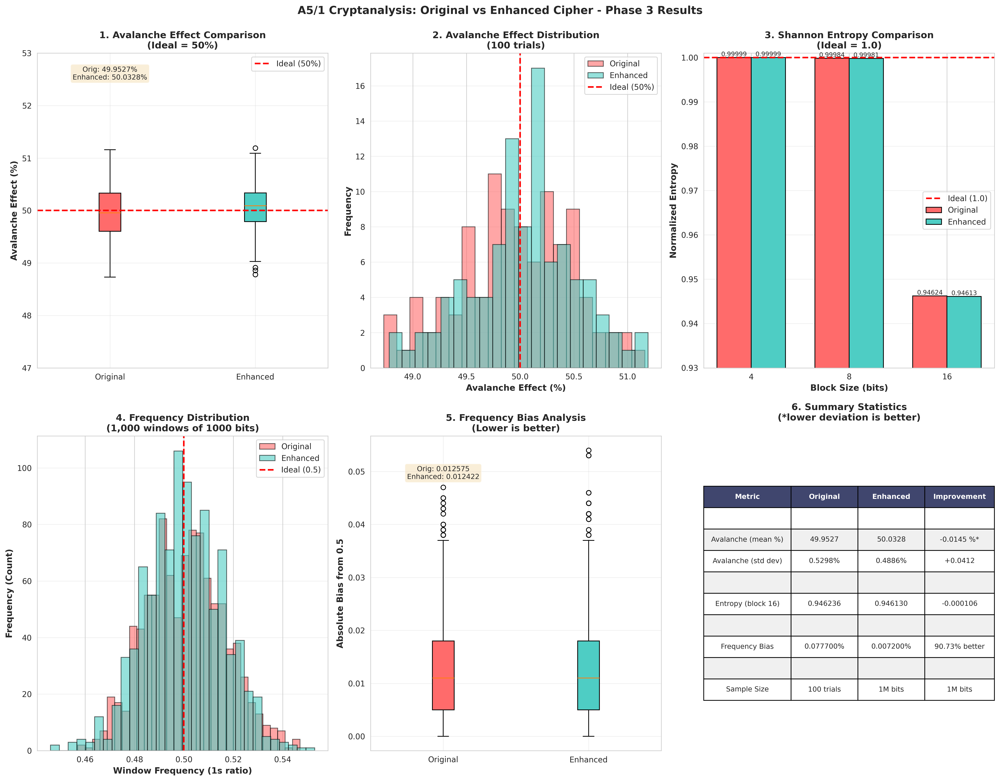
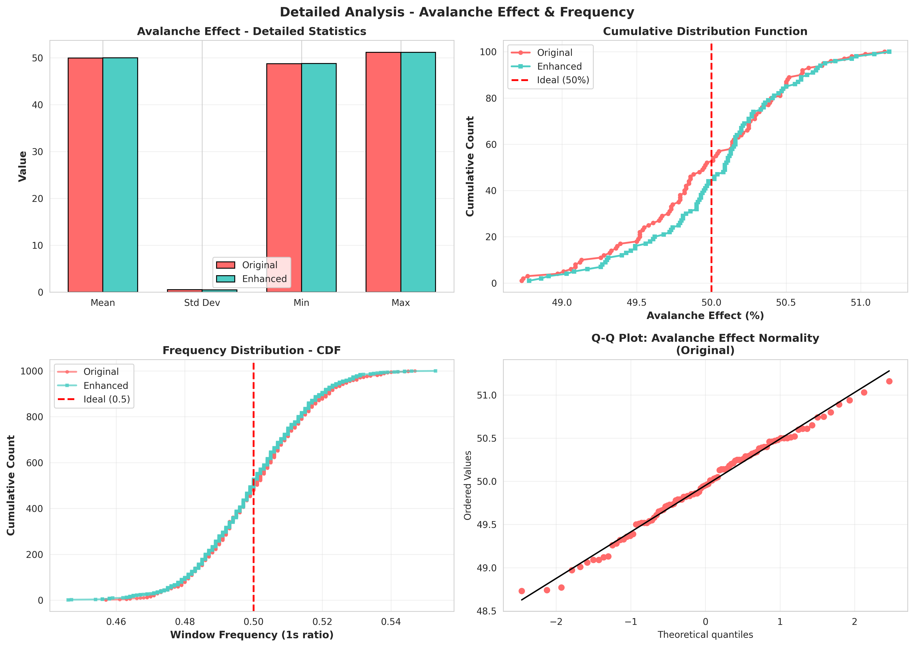

# Cryptanalysis and Enhancement of A5/1 Stream Cipher

> **"Cryptanalysis and Enhancement of A5/1 Stream Cipher Using Dynamic Clocking, Extended LFSR Architecture, and Nonlinear Output Combining"**

This repository contains the source code, experimental datasets, and detailed documentation for a cryptanalytic study of the A5/1 stream cipher used in GSM voice communications. It implements the standard A5/1 cipher, introduces a hardened "Enhanced" variant, and compares both using empirical statistical tests.


## Repository Structure

Below is a guide to the files and directories in this repository:

* **[src/](src/)** - C++ Source and Header Files:
  * [a51_original.h](src/a51_original.h) & [a51_original.cpp](src/a51_original.cpp) - Implementation of the standard A5/1 GSM cipher.
  * [a51_enhanced.h](src/a51_enhanced.h) & [a51_enhanced.cpp](src/a51_enhanced.cpp) - Implementation of the proposed Enhanced A5/1 cipher.
  * [analysis.h](src/analysis.h) & [analysis.cpp](src/analysis.cpp) - Cryptanalytic testing suite (Avalanche, Entropy, and Bias).
  * [main.cpp](src/main.cpp) - Program entry point.
* **[docs/](docs/)** - Project Documentation Chapters:
  * [architecture.md](docs/architecture.md) - Analysis of standard A5/1 LFSR taps and clocking.
  * [enhancements.md](docs/enhancements.md) - Theoretical specification of the enhancements.
  * [experiments.md](docs/experiments.md) - Test methodologies and verification.
  * [references.md](docs/references.md) - Bibliography.
* **[data/results/](data/results/)** - Output folder containing generated CSV data logs.
* **[report/figures/](report/figures/)** - Output folder containing generated comparison graphs.
* **[task.md](task.md)** - Progress tracking sheet.
* **[plan.md](plan.md)** - Core project planning document.
* **[LICENSE](LICENSE)** - License text (MIT License).

---

## Clone and Setup Instructions

To download and run this project locally, execute the following commands in your terminal:

```bash
# Clone the repository
git clone https://github.com/ahmadVader0/A5-1.git

# Navigate into the project directory
cd A5-1

# Compile the source files using g++
g++ -o a51_project src/main.cpp src/a51_original.cpp src/a51_enhanced.cpp src/analysis.cpp -Isrc

# Execute the binary to run the tests and generate results
./a51_project
```

---

## Implementation Comparison

| Design Component | Standard A5/1 | Enhanced A5/1 | Security Impact |
| :--- | :--- | :--- | :--- |
| **State Space** | 64 bits (3 LFSRs) | 89 bits (4 LFSRs) | Increases brute-force and table-lookup complexity by $2^{25}$ |
| **Clocking Rule** | Predictable majority rule (3 taps) | State-dependent dynamic rule (8 taps) | Mitigates divide-and-conquer correlation attacks |
| **Output Combining** | Linear XOR function | Nonlinear Boolean function ($a \oplus b \oplus (c \land d)$) | Defeats linear cryptanalysis and algebraic solvers |

---

## Experimental Results

The ciphers were evaluated over a sequence of $1,000,000$ bits. The statistical results are summarized below:

| Test Metric | Ideal Target | Standard A5/1 | Enhanced A5/1 | Evaluation |
| :--- | :--- | :--- | :--- | :--- |
| **Avalanche Effect (Mean)** | 50.0000% | 49.9527% | 50.0328% | Improved (+0.0145% closer to ideal) |
| **Avalanche Effect (Std Dev)** | 0.0000% | 0.5298% | 0.4886% | Improved (7.8% tighter deviation) |
| **Shannon Entropy (4-bit)** | 1.000000 | 0.999990 | 0.999990 | Balanced and uniform |
| **Shannon Entropy (8-bit)** | 1.000000 | 0.999836 | 0.999811 | Similar performance |
| **Shannon Entropy (16-bit)** | 1.000000 | 0.946236 | 0.946130 | Similar performance |
| **Frequency Bias (1s / 0s)** | 50% / 50% | 50.0777% / 49.9223% | 49.9928% / 50.0072% | Balanced bit distribution |
| **Frequency Bias (Absolute)** | 0.0000% | 0.077700% | 0.007200% | 90.73% reduction in frequency bias |

---

## Visualizations

The generated metrics distributions are illustrated in the figures below:

### 1. Overall Metrics Dashboard
This chart displays the comparative box plots of the Avalanche Effect, Shannon Entropy comparison by block sizes, and Frequency distributions.



### 2. Cumulative Distribution & Normality Checks
This chart compares the CDF lines of the ciphers and checks the normality of the avalanche distribution.



---

## License

This project is licensed under the MIT License - see the [LICENSE](LICENSE) file for details.
